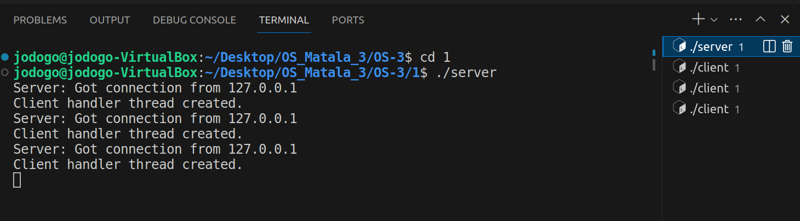
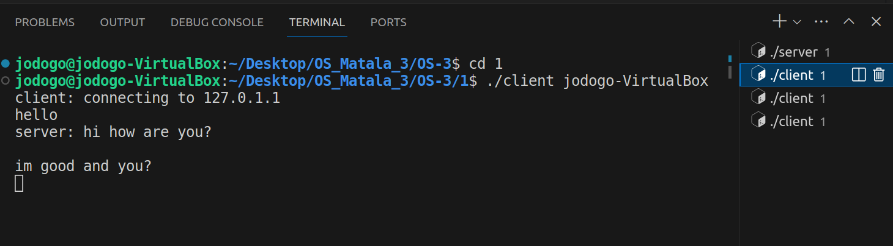
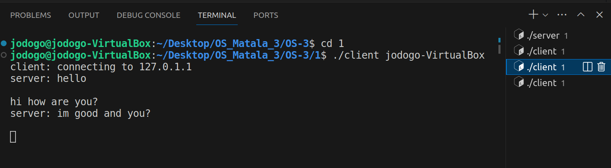
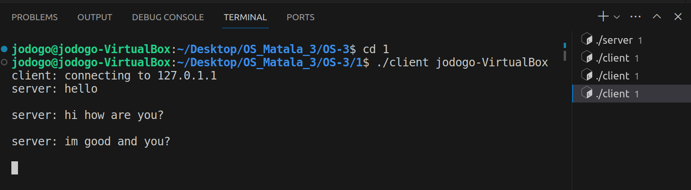
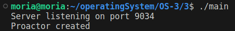
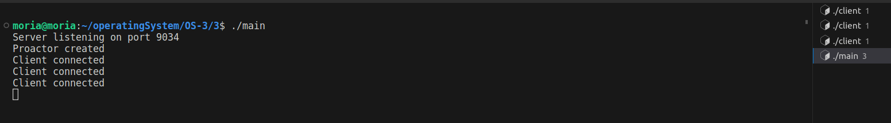
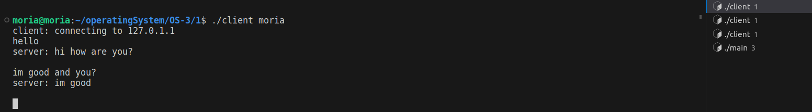
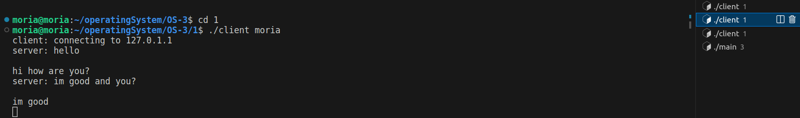
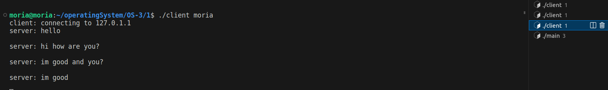
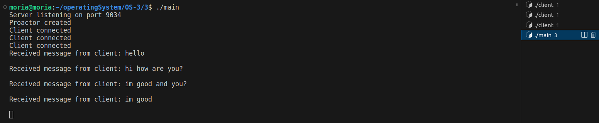

# OS-3

## Part A
#### (in folder 1)
In this part, we create the server and client with threads. one can run the server and then open multiple terminals and run the client. clients can chat in a group chat like fashion.

here we can see that we run the server and then open 3 terminals and run three clients.

the first client and second client type to each other through the server:

finally we can see the third client who did not type anything but was part of the conversation:

## Part B
#### (in folder 2)
In this part, we implement the proactor design pattern in the form of a libary that we then use in part C. out libary has three functions:

#### - 1 proactor_create(int port);
#### - 2 proactor_thread(void *arg);
#### - 3 void proactor_destroy(proactor_t *proactor);

the libray lets one create a proactor by giving its function the port number to create it on. and then runs a main thread for its logic called: proactor_thread , when finising it graccfuly exits using the proactor destroy function.

## Part c
#### (in folder 3)

in this part we have a simple main function that uses the proactor library we created. we then run multiple clients from Part A that connect to our proactor.

this part is based on the library in part B. to run this part you need at first create all the files in folder 2 by running make all and then run make all in this library.

we start by running main and hence our proactor is created:

we then run three terminals and connect clients from part A :

here are the first two clients talk to each other and the third is simpply part of the group convo:

client1:

client2:

client3:

finally we can see in the terminal of the proactor the follwing:

proactor (main):

